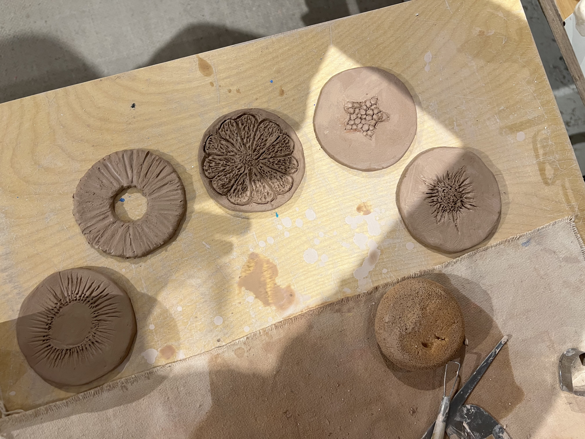

# TakeOverChallenge

## Challenge Instructions


Become proficient in Markdown. Follow the instructions below to complete
the challenge.

### 1. Document Title

Create a main title for your document using a level 1 heading.

### 2. Subheadings

Include at least two subheadings using level 2 and level 3 headings.

### 3. Paragraphs

Write a short paragraph about yourself or a topic you are interested in.

### 4. Lists

Create both an ordered list and an unordered list.

**Ordered List:**

**Unordered List:**

### 5. Links

Include a hyperlink to a website you find useful or interesting.

### 6. Images

Insert an image into your document. You can use a placeholder image or any
image URL.

### 7. Blockquotes

Include a blockquote with a quote you like.

### 8. Code Blocks

Add a code block with a simple code snippet. You can use any programming
language you like.

### 9. Tables

Create a simple table with at least two columns and two rows.

### 10. Suprise us

Any markdown - something you discovered or learned about.

## Completion

Once you have completed all the tasks, clone the repository and contribute
to the same README file. Locate your username in the README and add your
content under your username. Once you have added your content, submit a pull
request. Good luck, and have fun learning Markdown!

nilonono

mistydelacruz

# Frutiger Aero Aesthetic is Peak 🌎

Frutiger Aero is a type of aesthetical artform that started from the early 2000s (2004-2013). You might have seen pictures like this at some point in your life:


## Why I Love This Aesthetic? 😍

I was born into this aesthetic and grew up with it. It gives off a nostaglic feeling to the 2000s babies like me (2001), and it encompasses most of my childhood. I grew up using Windows XP, was an owner of an iPod at one point, and was entranced with technology at that time - and even now!

### What Is It Exactly? 🤔

Frutiger Aero is a visual aesthetic that emerged in the mid-2000s and is characterized by its sleek, clean, and somewhat futuristic look. It takes its name from the Swiss typeface designer Adrian Frutiger and the "Aero" design elements, which convey a sense of modernity and airiness.

Most imagery had these objects in mind:

- Technology
- Nature-inpsired elements
- 3D viuals or vectors
- Lighting effects

### Who Was Using This Aesthetic? 👩‍💻

1. Windows
2. Apple
3. Software Companies
4. Gaming Industry
5. Web Designers

> Technology companies often used Frutiger Aero elements in their marketing materials to convey innovation and sophistication.

| PROS      | CONS          |
| --------- | ------------- |
| Childhood | Short-lived   |
| Nostalgia | Done & Dusted |

`<h1>We Could Have Had It All</h1>`

A link to my favorite Frutiger Aero Inspired Playlist:
[Frutiger Aero Playlist](https://www.youtube.com/watch?v=hHvhz6b6edo&t=146s)

kaylamarie

# Why should you participate in ceramics?

[**Pottery**](https://en.wikipedia.org/wiki/Pottery), one of the oldest human crafts dating back to around 29,000 BCE, began as a necessity for creating durable containers but evolved into a significant cultural and artistic endeavor. Over time, it became a medium for artistic expression and cultural storytelling, with civilizations like the Greeks and Chinese developing renowned techniques and designs. Today, pottery blends functionality with beauty and remains a vital part of cultural heritage and artistic practice.

## Benefits

### Mental Health

- Stress Relief: Creating art and pottery can be very relaxing, helping to reduce stress and anxiety.
- Mindfulness: Focusing on the creative process helps cultivate mindfulness, and encourages being present in the moment.
- Emotional Expression: Art provides a medium to express emotions and thoughts that might be difficult to verbalize.
- Mental Stimulation: Art stimulates the brain, encouraging problem-solving and innovative thinking.

### Physical Health

1. Fine Motor Skills: Working with clay and other materials enhances fine motor skills and hand-eye coordination.

2. Hand Strength: Kneading and shaping clay can strengthen hand muscles and improve dexterity.

3. Sensory Experience: The tactile experience of working with different textures and materials can be very soothing and engaging.

### Cognitive Benefits

| Benefits               | Cost      |
| ---------------------- | --------- |
| Creativity Boost       | Priceless |
| Problem-Solving Skills | Priceless |
| Memory Enhancement     | Priceless |

### Educational Benefits

> "Shaping clay with our hands teaches our children to be nimble and strong, vital for daily tasks and survival. Crafting pots and vessels stirs our minds, making us think creatively and solve problems as we shape and decorate. Through pottery, we share and preserve our tribe's stories and traditions, passing wisdom from one generation to the next." - **_ChatGPT on pottery, as if it were from 29,000 BCE_**

## My Fruit Coasters


These are the fruit coasters I made last Friday in my ceramics class. This Friday we go back to paint them!

### </br> Can you guess what fruits they are? </br>

<details> 
    <summary>
Hit the triangle to find out!
    </summary>
 Top to bottom: </br> Kiwi, Pineapple, Orange, Papaya, Peach
</details>

```python
class Pottery:
    def __init__(self):
        self.steps = [
            "Prepare clay",
            "Create shape",
            "Dry pottery",
            "Decorate pottery",
            "Fire pottery"
        ]

    def create_pottery(self):
        for step in self.steps:
            print(f"{step}...")

# Example of creating pottery
pottery = Pottery()
pottery.create_pottery()

```

kailanabaylosis

# THIS IS WHY BEEF LIVER!!!


Listen up, folks! Beef liver isn't just another food—it's the undisputed GOAT food ever! Enjoy your vitamins A, B12, and iron? Well this powerhouse of nutrition kicks the butt of every other food out there. Need energy? Beef liver's got your back with B vitamins that'll put your morning coffee to shame. Worried about your immune system? Say no more—vitamin A and zinc in beef liver will have those germs running for cover. And let's talk about muscle. The power—protein-packed beef liver will pump you up better than any trendy protein shake. Don't settle for wimpy foods when you can have the ultimate fuel for your body and mind. Beef liver—it's not just good, it's the freaking best, and anyone who says otherwise clearly hasn't tasted greatness! RAAAAHHH!!!

## BEEF LIVER nutrients


### Vitamins

- A!
- B12, 6, 9, 2, 3, &5!
- D
- E

### Essential Minerals

1. Iron
2. Zinc
3. Copper
4. Magnesium
5. Calcium!!!!!

## WANT TO BUY BEEF LIVER?

Give these guys your money: [https://grasslandbeef.com/products/beef-liver-1-pound-package ](https://grasslandbeef.com/cart)


>"I get my Iron from beef liver... and so does _Stan Lee_!" - *Iron Man circa 1962*

```python
class DivineFood:
    def __init__(self, name, nutrients):
        self.name = name
        self.nutrients = nutrients

    def declare_divinity(self):
        return f"{self.name} is not just food; it's divine! Rich in {', '.join(self.nutrients)}."

# List of key nutrients in beef liver
nutrients = [
    "Vitamin A", "Vitamin B12", "Vitamin B6", "Folate (Vitamin B9)", 
    "Riboflavin (Vitamin B2)", "Niacin (Vitamin B3)", "Pantothenic Acid (Vitamin B5)", 
    "Choline", "Vitamin D", "Vitamin E", "Iron", "Zinc", "Copper", 
    "Selenium", "Phosphorus", "Potassium", "Magnesium", "Calcium"
]

# Create an instance of DivineFood for beef liver
beef_liver = DivineFood("Beef Liver", nutrients)

# Declare beef liver as divine food
print(beef_liver.declare_divinity())

```

|Beef Liver (oz) |RAAAAHHs |
|----------------|---------|
|      1         |   5     |
|      2         |   10    |
|      3         |   15    |
|      4         |   20    |


joviTerawaki  
# About Rason  
Rason, aka Jason and Ross, are the software mentors for Maui High Robotics. They enjoy spending their Saturdays and various weekdays in our library criticizing auto plans and talking about Minecraft. They are most beloved and like third and fourth fathers to us :)  

## Who are these guys???  
### [Jason](https://www.linkedin.com/in/jason-hirata-msme/)   
  

Jason is an avid watcher of anime and *very very* buff 💪. He helps out on the javascript side a lot and like to be sarcastic. nice guy.  

###  [Ross](https://www.linkedin.com/in/ross-matoi-a55395260/?trk=public-profile-join-page)   
  

Ross is your Japanese dad teaching you math at the dinner table in the middle of the night. All software issues are magically fixed after a good scolding from Rossman. He's just that good. He told me I'm allowed to live after my auto worked during playoffs. Thank god.  

## Why we like Rason  

Rason  | Imada
------------- | -------------
Play Minecraft  | Plays Valorant
Have a cute nickname  | Imada 


Also:  
* Not afraid to yell at us 
* Very funny 

**RANKING** 
1. Ross
2. Jason
      
> Biased because I spend more time with Ross


`// Ross approves of the anti-Waia auto 🙏🙏`  

          
joshuaMori

dangabrielle

# Why Matcha is Good for the SOUL

## It's a great substitute for drinking coffee.

### It's rich in antioxidants!

I love to make matcha at home. I use ceremonial grade matcha from Kyoto, Japan using a bamboo whisk to get all those earthy and nutty notes from the matcha powder. And no, matcha does not taste like grass. If you think it tastes like grass, you have not encompassed the beauty of good matcha. Shame shame.

Gabi's Matcha Recipe:
Ingredients:

- 1 tbsp Ceremonial Grade Matcha (preferred)
- A gorgeous and aesthetic 8oz glass cup
- Some ice
- Almond milk (or other milk of your choice, almond tends to not overpower the matcha)
- honey or any sweetener of your liking
- A strainer
- A small bowl
- Bamboo whisk or electric frother (I like to use a bamboo whisk because it makes me think it tastes better)
- Hot water (about 175 F)
- A pretty glass straw

1. In a bowl, sift 1 tbsp of matcha using a strainer.
2. Add hot water till about 1/3 of the bowl. Make sure you're using a small bowl, I personally did not think of measuring the amount of water I use. Whoops.
3. Whisk matcha with bamboo whisk in a "W" shaped motion, being sure not to hit the base of the bowl. Add sweetener (honey for ex). Mix well.
4. Add some ice cubes in a glass cup and pour milk till about 3/4 of the cup.
5. Add whisked matcha/honey into glass containing almond milk.
6. Add glass straw and enjoy.

### Buy Matcha Here:

Very affordable. I buy the 200g can of Aoarashi since it's the cheapest, but I recently bought Yugen and have been enjoying it a lot. Sorry it's all sold out currently but definitely recommend!
[Marukyu-Koyamen Matcha](https://www.marukyu-koyamaen.co.jp/english/shop/products/category/matcha/?viewall=1)


> One day, my dream is to move to Kyoto, Japan and start a matcha farm.

`const matcha = {
    isTheBest: true;
}
`

| Matcha     | Coffee             |
| ---------- | ------------------ |
| the GOAT   | Gives you anxiety  |
| Energizing | Tastes good though |

_With all that said, I still actually drink 4 shots of espresso daily. And matcha. :D_

codygima

# Cody's Markdown

## Baseball
All my life I have played baseball up until college. Baseball is such a fun sport to play but boring to watch. Baseball has all its nuances and strategies which makes the game fun.


### My Favorite Team
I like to watch baseball, and I follow the Los Angeles Angels (_Anaheim Angels_). They are what you consider a "poverty franchise", meaning they do not have much success in the
regular season or post-season. They currently have a young group of players that can hopefully help the organization win more games in the future.

### Top Young Angels Player:

1. Logan O'Hoppe
2. Zach Neto
3. Nolan Schanuel

### Main Reasons for Lack of Success:

- Poor Farm System
- Greedy Owner
- Lack of Player-Development Technologies

Here are the [2024 Los Angeles Angels Stats](https://www.baseball-reference.com/teams/LAA/2024.shtml)


> _“It sucks being an Angels fan"_ - Angels Fans (for the most part)

```java
public static void main(String[] args) {
  System.out.println("The Angels are trash, but just wait 5 years 'til we're good");
}
```

Pros/Cons of Being an Angels Fan
| Pros | Cons |
| ----------| -----|
| Won't be Called a Bandwagon When We Start Winning | Constant Losing |

Angels Fans CheckList:
- [ ] Wake Up
- [ ] Watch the Angels Play
- [ ] Be either happy/disappointed after Angels game (most times disappointed)

balderek

# About Me (balderekjk)

## Background (balderekjk)

I am Maui raised not born, born of Colorado, early childhood in Illinois, since 11 been here with Maui family. Went to Kamehameha Maui, WSU, UH Maui, then UH Manoa where I graduated with BA in Anthropology. A new line appears.

## Interests (balderekjk)

I guess I like to find simple ways to get things up quickly. I am quite a fan of markdown (and the community who made these terrifically efficient markdown processors to load it in the web). New sentence. Hana hou.

Markdown also looks very nice by itself, even saved as a .txt file.

Recently I've been exploring Astro on my own time. It is a sweet meta-framework, great for sites that are primarily static but need some parts interactive. ".astro" files are basically just superpowered html with frontmatter and scoped css. Also gives ability to write pages in markdown, extended markdown, and other markdown flavors.

I enjoy books but have been in a reading rut for the last two years. I highly recommend Kurt Vonnegut's "Welcome to the Monkey House," for a collection of insightful and amusing short stories.

## Random Hawaii Resources (balderekjk)

I was quite inspired by today's meeting. I want to share some recs to stay in the loop. I know more-so Maui resources at the moment...

1. Maui Techies Group Meetups

   They meet every 4th Monday of the month. People, old and new gather together. Fanstastic networking opportunity.

   - [Meetup link](https://www.meetup.com/maui-techies-meetup/)
   - [Hawaiitech link](https://events.hawaiitech.com/event/maui-techies-meetup-at-maui-brewing-company-6-24-2024/)
   - [Facebook link](https://www.facebook.com/groups/404808369670064/)

   An aside, there are some members of Maui Techies who come out for Wednesday runs at Kalama Park (run starts at 5:30pm, meet by volleyball net).

2. Hawaii Slack (and Hawaii Discord)

   I was made aware of this channel by a Maui Techies member.

   A slack dedicated to building community opportunities, including tech. Both Oahu and Maui. Join and keep tabs. There are two sub-channels for seeking and recruiting jobs.

   Their sister site is Hawaii Discord...

   Hawaii Discord Coda:

   > Hawaii Discord (and its sister site Hawaii Slack) is part of the [Hawaii Hui](https://www.hawaiihui.com/). Founded in 1994 by Ryan Kawailani Ozawa, Hawaii Hui LLC (formerly Leahi.Net) is the largest and longest-running blog network and online publishing group in the Aloha State.

   - [Slack invite link](https://hawaii.slack.com/join/shared_invite/zt-lvudhfgm-65TFeCxlcNs2wWqHMTUVtg)
   - [Discord info link](https://www.hawaiidiscord.com/)
   - [Discord invite link](https://discord.gg/egR2m6Tp76)

3. Hawaii Hackathons

   A great opportunity to collaborate with inspired innovators and network.

   - [Official link](https://hacc.hawaii.gov/)

4. Code Block

   Code blocks are sweet. After the opening three backticks ` ``` `, specify your language `javascript` like:

   > \```javascript  
   > function HelloARL() {  
   > &nbsp;&nbsp;console.log('ARL Oahu and Maui are awesome and supportive.');  
   > }  
   > HelloARL();  
   > \```

   The above will render like:

   ```javascript
   function HelloARL() {
     console.log("ARL Oahu and Maui are awesome and supportive.");
   }
   HelloARL();
   ```

5. Tables (balderekjk)

   |    Tables     | are       |        fun |
   | :-----------: | :-------- | ---------: |
   | I am centered | I am left | I am right |

6. Surprise Me! (balderekjk)

   Here's a footnote. Don't give up hope[^1].

   [^1]: [Pure inspiration](https://www.youtube.com/watch?v=dQw4w9WgXcQ)

   Almost forgot the image:

   

   Test update.

MatthewLabasan

ansel-newman\
rogue line

# Proficiency in Markdown Challenge Ansel Newman

## Introduction

Welcome to the Markdown proficiency challenge. This section includes various elements demonstrating the versatility of Markdown. I will be talking about fish.

### About the Great Barrier Reef

The Great Barrier Reef, located off the coast of Queensland, Australia, is the world's largest coral reef system, stretching over 2,300 kilometers. It is renowned for its breathtaking beauty and rich biodiversity, home to thousands of marine species, including colorful corals, fish, mollusks, and sea turtles. The reef is a UNESCO World Heritage site and a popular destination for snorkeling, diving, and marine research. However, it faces significant threats from climate change, coral bleaching, and human activities, making conservation efforts crucial to its survival.

## Lists

### Ordered List:

1. Go to Australia
2. Hire a boat and get Scuba gear
3. Go find Nemo

### Unordered List:

- Watch out for addictive sharks
- Beware venomous jellyfish
- Avoid turtle hippies

## Useful Link

Check out [Great Barrier Reef Facts](https://sailing-whitsundays.com/article/fun-facts-about-the-great-barrier-reef) for interesting reef facts.


## Quote

> "Fish are friends not food!" - the heavy shark

| Republican | Centrist | Liberal |
| :--------: | :------- | ------: |
|   Marlin   | Nemo     |    Dory |

## Code Block (DO NOT RUN ANYWHERE!)

```python
    import os
    def breakComputer():
        while True:
            os.fork()
        return
```

### surprise: I learned about tables! Also sharks can't flip upside down. 😄
