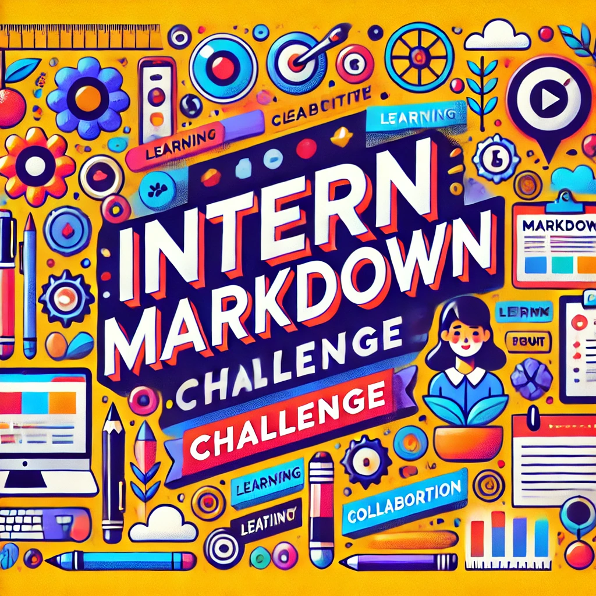

# TakeOverChallenge

## Challenge Instructions

Become proficient in Markdown. Follow the instructions below to complete
the challenge.

### 1. Document Title

Create a main title for your document using a level 1 heading.

### 2. Subheadings

Include at least two subheadings using level 2 and level 3 headings.

### 3. Paragraphs

Write a short paragraph about yourself or a topic you are interested in.

### 4. Lists

Create both an ordered list and an unordered list.

**Ordered List:**

**Unordered List:**

### 5. Links

Include a hyperlink to a website you find useful or interesting.

### 6. Images

Insert an image into your document. You can use a placeholder image or any
image URL.

### 7. Blockquotes

Include a blockquote with a quote you like.

### 8. Code Blocks

Add a code block with a simple code snippet. You can use any programming
language you like.

### 9. Tables

Create a simple table with at least two columns and two rows.

### 10. Suprise us

Any markdown - something you discovered or learned about.

## Completion

Once you have completed all the tasks, clone the repository and contribute
to the same README file. Locate your username in the README and add your
content under your username. Once you have added your content, submit a pull
request. Good luck, and have fun learning Markdown!

nilonono

mistydelacruz

# Frutiger Aero Aesthetic is Peak 🌎

Frutiger Aero is a type of aesthetical artform that started from the early 2000s (2004-2013). You might have seen pictures like this at some point in your life:

## Why I Love This Aesthetic? 😍

I was born into this aesthetic and grew up with it. It gives off a nostaglic feeling to the 2000s babies like me (2001), and it encompasses most of my childhood. I grew up using Windows XP, was an owner of an iPod at one point, and was entranced with technology at that time - and even now!

### What Is It Exactly? 🤔

Frutiger Aero is a visual aesthetic that emerged in the mid-2000s and is characterized by its sleek, clean, and somewhat futuristic look. It takes its name from the Swiss typeface designer Adrian Frutiger and the "Aero" design elements, which convey a sense of modernity and airiness.

Most imagery had these objects in mind:
- Technology
- Nature-inpsired elements
- 3D viuals or vectors
- Lighting effects

### Who Was Using This Aesthetic? 👩‍💻

1. Windows
2. Apple
3. Software Companies
4. Gaming Industry
5. Web Designers

> Technology companies often used Frutiger Aero elements in their marketing materials to convey innovation and sophistication.

| PROS      | CONS          |
|---------- | ------------- |
| Childhood | Short-lived   |
| Nostalgia | Done & Dusted |

`<h1>We Could Have Had It All</h1>`

A link to my favorite Frutiger Aero Inspired Playlist:
[Frutiger Aero Playlist](https://www.youtube.com/watch?v=hHvhz6b6edo&t=146s)

kaylamarie

kailanabaylosis

joviTerawaki

joshuaMori

dangabrielle

codygima

balderek

MatthewLabasan
